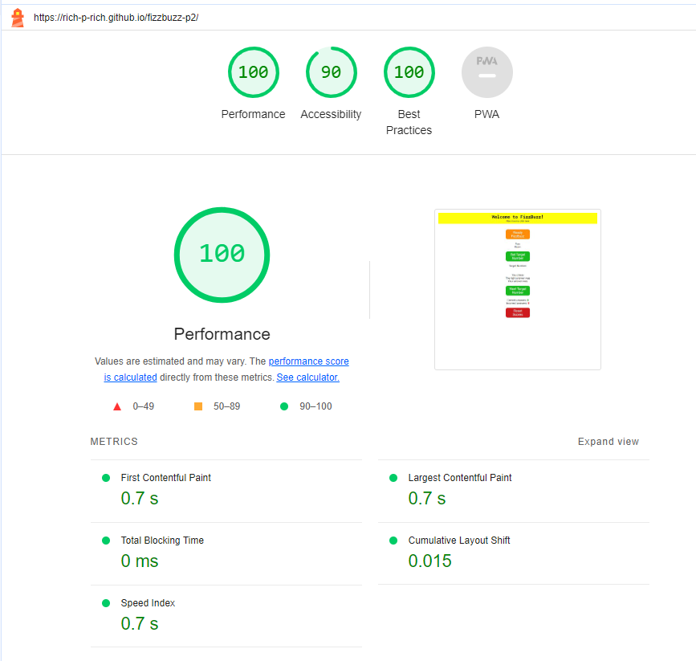
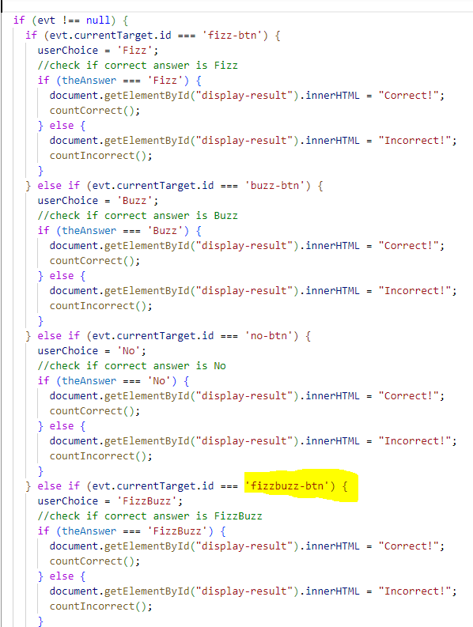
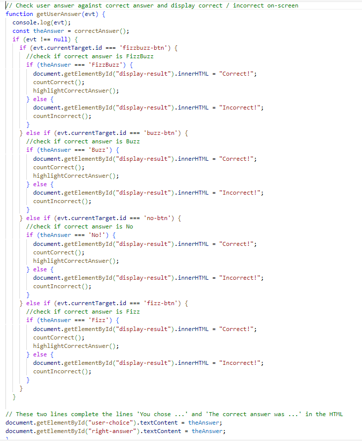
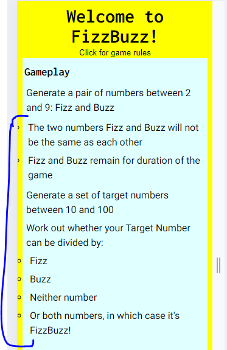
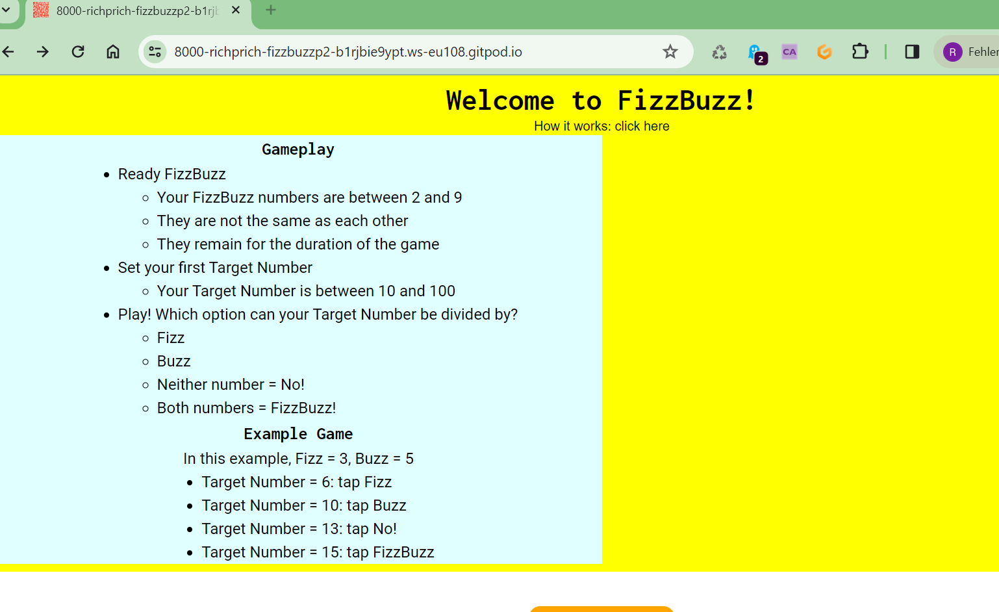
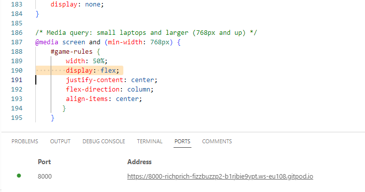
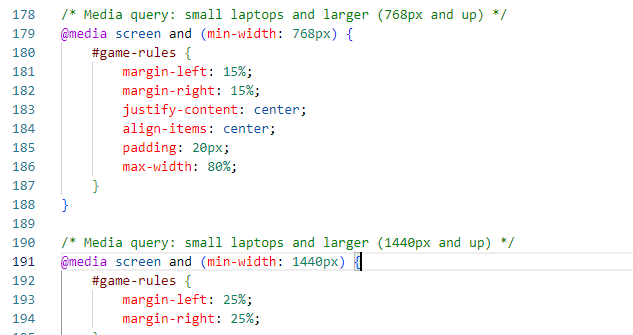

## Project Two: Javascript and  FizzBuzz

For Project Two I have created a multiple choice version of the maths game "FizzBuzz." In its traditional form, you choose two base numbers, one called 'Fizz' and one called Buzz; then, if for example your Fizz number was 3, and your Buzz number was 5, you would proceed to count, saying Fizz for every multiple of 3, Buzz for every multiple of 5, and FizzBuzz for every number that is a multiple of both.  

*image taken from https://www.youtube.com/watch?v=QPZ0pIK_wsc*

I took the idea from a video called "FizzBuzz: One Simple Interview Question" by the YouTuber and podcaster Tom Scott (https://www.youtube.com/watch?v=QPZ0pIK_wsc). I have been teaching English to computer scientists, among other students, at the Deggendorf Institute of Technology (the DIT) in Germany since April 2020, and this is one of the videos I use in class. 

*image taken from https://www.youtube.com/watch?v=QPZ0pIK_wsc*

I have always enjoyed this video, in particular the emphasis he puts on making the code easy to read, change and maintain. I worked in E-commerce in a previous career, and one of the shops I worked for used legacy code for its platform. This was extremely difficult and time-consuming to maintain and update which meant that implementing updates to the website was painful and costly; we had IT releases every second Monday and they invariably caused significant problems, including loss of sales due to poor website functionality following the release. Additionally, I set up an essay and writing skills for history undergraduates while I was doing research at University College London in the UK; this course had a strong focus on writing clearly and concisely, so the value Tom attaches to clear and direct code-writing, without repetition, resonated with me. 

FizzBuzz therefore seemed like a natural fit for Project 2, not least because, in the above video, Tom writes his solution in Javascript, and this was my chance to actually try out different ways to solve this question. However, the setting for my version of the game is quite different to that shown in the video, which demonstrates a 'one-time' solution to coding the FizzBuzz problem in a job interview setting. 

In contrast, I wanted to turn it into an interactive online game. I wanted to avoid asking the user to type in numbers, and asking the user to count in a linear manner per the traditional form of the game did not seem very promising. 

I therefore made a multiple choice game in which:
- the Fizz and Buzz numbers stay constant for the duration of the game 
- the player has a Target Number to solve (with the 4 options described below)
- each Target Number represents a new question, and so the player constantly gets new Target Numbers for as long as they are playing 

The player chooses from four options to solve the Target Number question: 
- Fizz and Buzz, as outlined above
- The player can choose 'No' when the Target number cannot be divided by either Fizz or Buzz
- The player can also choose 'FizzBuzz' as an option when the Target Number can be divided by both the Fizz and Buzz numbers.  

I have tried to design it so that anyone who can read and operate a mobile phone / web-browser can play the game; it would work well for children / young teenagers who want to practise their maths, but I think it works well for people of all ages.  

## Gameplay: Development 

My plan for the scoring system has changed since I wrote my Wireframe. Originally I planned to have a correct 'FizzBuzz' answer worth 2 points, and any other correct answers worth 1 point; if the answer was FizzBuzz, and the player had clicked on the mathematically correct option of Fizz or Buzz, I would have also given the player 1 point. I found this too complicated during the development of the game, however, and so left it at 1 point per correct answer.  

I also planned originally to set the player a sequence of 10 Target Numbers as I thought this would be a good way to set some structure for the player. I decided, however, that offering the player the chance to play for as long or as short as they like is fine, and setting a limit to the questions may be an option for future development.  

## Orientation

- I have followed the 'mobile first' principle when designing this game. My first concern was that it presented and functioned well on mobiles, then on laptops and desktops. I think this is realistic - this is the type of game someone would play on their mobile device, even though it works fine on laptops / desktops. 

- As the layout is essentially linear, I have only added two media queries to style the information box in the header so that it looks good on tablets and larger screens.  

    - Tablet view: 

    - Laptop view: 

- Audience. I have in mind anyone who wants to practise their maths skills, and I imagine this would work well as a game for kids and teenagers to practise division and multiplication. For that reason, I have kept the gameplay as simple as possible and kept the amount of text to a minimum; additionally, I have tried to keep the text divided up into small chunks. In essence, anyone of any age can play it, and anyone with limited English skills can play it too.

## Features

**Header**
- In the header you can find a button called 'how it works: click here.' By clicking this button, you can display an explanation of the gameplay and scoring, plus an example game. 
I included this via a toggle feature so that the player does need to switch pages to look at the rules - so no extra page is needed - nor does the player need to have the rules constantly visible, which would take up valuable screen space. I also thought that having the rules constantly open would be off-putting for first-time visitors.  

Initially I had the rules in a separate clickable button underneath the header and above the 'Ready FizzBuzz' button, but after testing this on my mobile, I decided this was a taking up too much space: it was forcing the 'Reset Scores' button down out of view, so I decided to embed the feature in the header itself. 

**Page Layout and Style** 
- I have deliberately kept things simple, reflecting the simple nature of the game. I experimented with different background colours and styles, but settled on a plain white background with the buttons in primary colours; the text in the buttons is white as this shows up best against the colour of the buttons.  

- Colour choice. The use of primary colours in the page is also a nod to the probability that the real-life audience of this game would consist of children.  

- Vertical alignment. Give that this would probably be played on mobile or tablet devices, I felt that a vertical alignment works best to avoid any confusion. The player goes intutitively from 'Ready FizzBuzz' to 'Set Target Number'; this reveals the answer options below, and the player can choose the next Target Number, see their scores, or re-set their scores by following a simple vertical line.  

## Functionality per Button

**Ready FizzBuzz**

- This button generates the Fizz and Buzz numbers you need to play the game. 
- I have limited the numbers to between 2 and 9 for this version of the game
- Both numbers are deliberately different to each other, as otherwise there is no point having both 'Fizz' and 'Buzz'.
- In future versions of the game, I would like to include more difficult FizzBuzz numbers, e.g. 11 - 100 and above by allowing the user to choose a more difficult level.

*Additional functionality*
- This is one of the two buttons which needs to be clicked in order to make the answer section visible. The other is the 'Set Target Number' button.  
- This button resets the 'correct / incorrect' feedback to blank as, by clicking this button, the player is essentially starting a new game
- This button also re-sets the score to zero. If the player changes the FizzBuzz numbers, they are essentially starting a new game, which is why I added the 'reset scores' function to this button as well.  

 
**Set Target Number**

- This button generates the first target number, which is limited to between 10 and 100.  
- By clicking on this button as well as the Ready FizzBuzz button, the answer buttons will be revealed.  
- The player can also choose another Target Number if they don't like the one given to them; this does not re-set the scores.  
- The button also sets the 'correct / incorrect' feedback to a blank string so that the player can continue to get feedback for each new target number.

*Additional notes*
- The 'Set Target Number' works from the same line of code as the 'Next Target Number'. Both of them will generate a new target number and help enable the answers. I chose to add a 'Next Target Number' because I felt the player needed an extra prompt after submitting their answer: 'Next' Target Number is a prompt to carry on, and in terms of the layout of the game, having this prompt button close to where the user has probably had their thumb after answering seemed like a good idea.  

**The Answer Buttons** 

- **Hiding the answer buttons.** I have deliberately kept the answer buttons hidden until the user has clicked on Ready FizzBuzz and Set Target Number. As the FizzBuzz and Target Numbers are essential for playing the game, it made sense to compel the player to click on them. I considered greying out the answer buttons as a sign to the player that the answers are not yet enabled, but decided that this would raise more questions in the player's mind. So I chose to hide them completely. This gives the player no choice but to follow the directions given by the 'Ready' FizzBuzz and 'Set' Target Number buttons.    

Before the FizzBuzz and Target Number buttons are clicked, the page looks like this:

Both the FizzBuzz and the Target Number buttons needs to be clicked to reveal the answer buttons.

With just the FizzBuzz button clicked: 

With just the Target Number button clicked: 

With both FizzBuzz and Target Number buttons clicked: 

- Naming the answer buttons. I deliberately used the imperative forms of 'Ready' and 'Set' because it is telling the user what to do; it also nicely echoes the instructions given at the start of a race so the sequence of operations should feel more intuitive. 

**Choosing the answer** 

- The player can only click one button, one time, per Target Number  
- By clicking on any of the four options, the player gives their answer and immediately sees underneath the answer buttons if it was correct or incorrect  
- A this point, the answer buttons are no longer clickable and I put their opacity at 50% to sigal to the player that they cannot be clicked 
- Laptop and Desktop users will also see that the mouse cannot be clicked when they hover the cursor over the buttons
- The player needs to click on 'New Target Number' (or 'Set Target Number') to make the answer buttons clickable again

On the left the answers are available, on the right the answers are disabled and faded-out after the user has chosen their answer:

**Layout and Style of Answer Buttons**
- I went with four vertically-stacked buttons as I thought it was important to have space between them to avoid players mistakenly clicking on the wrong button, e.g. 'No' rather than 'FizzBuzz' 
- The vertical design also suits the narrower mobile screen 
- I put 'No!' at the bottom because it is the most common answer, so having it next to the 'Next Target Number' button makes the most sense, ergonomically.  
- The answer buttons have a deliberately different style to the other buttons on the screen in order to differentiate them and identify them as special.  

**User feedback**
After clicking their answer, the user gets three pieces of feedback:
- "You chose ..." This confirms to the reader what their choice was; it can be quite easy to forget which option you have chosen with these type of games so I decided to confirm this to the player here. 
- "The right answer ..." This tells the user what the right answer was. I think this is important when players get the answer wrong, so they can compare their answer with the correct answer.
- "Your answer was ..." This tells the player whether their answer was correct or incorrect. 

All three pieces of feedback are always shown, regardless of whether the player got the question right or wrong.  

The feedback sentences are deliberately between the answers and the 'Next Target Number' button to reflect the player's process -> answer question, find out if it was right, next question.

I originally planned to highlight the correct button with a green border once they player had entered their answer. However, this did not fit with the plan to disable the buttons after the user clicks their answer: a greyed-out button with a green border is a confusing mix of visual cues. Therefore I decided to simply write out the three bits of information as described above, as this is clear and transparent for the player.

**Next Target Number**
- This button generates the next target number and, by doing so, enables the answer buttons again.  
- I added this button so the user doesn't have to move up above the answer buttons again
- Also the description 'Next Target Number' is more accurate here than 'Set Target Number', because the player already has set a Target Number -> they just need a new one. 

**Keeping Score** 
- This keeps a count of the number of correct and incorrect answers the user has submitted.
- This is based closely on the function used in the LoveMaths walk-through project on the CodeInstitute. I could not find a better way of doing it so adapted it to my game. I have noted this in the code itself with a comment above the 'countCorrect' function.
- In a more advanced iteration of this game, I would like the user to be able to add their username in a scoreboard; or in a timed game, this would show 'X number of correct answers in 60 seconds.'  

**Reset Score**
- This button sets the number of correct / incorrect scores to zero in case the user wants to do this. 
- The score will also be reset when the user generates a new set of FizzBuzz numbers.  

## Features Left to Implement and Next Steps

I would like to implement one or both of the following:

- A timer: e.g. complete as many answers as possible in 60 seconds.
- Difficulty levels: I would like to enable more challenging FizzBuzz numbers and Target Numbers. Therefore if I was to work more on this, I would allow the user to choose a base level (as implemented in this version), then one or two more difficulty levels.
- A user name so that the player can keep track of their scores.  

**Follow-up to the Tom Scott video: clean code and maintainability.** If I had to chance to revise this project, I would try to make the coding more concise as Tom Scott describes in the video I referenced at the start of this ReadMe. At this stage, I do not have the knowledge to do this properly, but I think it would make a good follow-up project when I have increased my knowledge about JS.  I found JS extremely challenging to begin with, but working with it was interesting and it is something I would like to come back to in the future. 

## Validator Testing 
HTML. I used https://validator.w3.org/#validate_by_input by direct input to test the HTML. There are no remaining errors.  

CSS. I used https://jigsaw.w3.org/css-validator/validator by direct input to test the CSS. There are no remaining errors.  

I used https://jshint.com/ to test my javascript. The only remaining feedback I have is the comment that 'getUserAnswer is an 'unused variable'. However, it refers to the 'onclick' attribute 'getUserAnswer' in the HTML which I used to capture the user's answer. I have also made this comment in my JS code.  

## Lighthouse Testing 

The lighthouse testing returned good results.

- Mobile results: 

- Desktop results: 

## Testing: appearance and functionality
- Testing done on Chrome, Firefox, Samsung Internet version 23.0.1.1 on a Samsung A33.
- Mobile testing included portrait and landscape views.
- Link used: https://rich-p-rich.github.io/fizzbuzz-p2/
- Also used for testing: Chrome Dev tools

| Test                                              | Expected outcome                                    | Result |
| ------------------------------------------------- | --------------------------------------------------- | ------ |	
|Header - 'click here'                     | Show gameplay explanation   	        | Pass   | 
|Header - 'click here'                     | Hide gameplay explanation   	        | Pass  |
|Click Ready FizzBuzz                     | Generate a Fizz and Buzz number         | Pass   | 	      	
|Click Ready FizzBuzz                     | The Fizz and Buzz numbers are different        | Pass | 
|Click Ready FizzBuzz                     | The Fizz and Buzz numbers are between 2 and 9        | Pass |  
|Click Ready FizzBuzz after player has started a game | Clears user feedback section and scores         | Pass  |
|Click Set Target Number | Generates a number between 10 and 100        | Pass  |
|Click Ready FizzBuzz and Set Target Number | Reveals answer buttons        | Pass  |
|Click Ready FizzBuzz and Set Target Number  | All answer buttons are clickable         | Pass  |
|Click Set Target Number after an answer has been given | Enables answer buttons        | Pass  |
|Click Fizz answer button | Signals that the user has chosen Fizz        | Pass  |
|Click Fizz answer button | Answer buttons are now disabled     | Pass  |
|Click Fizz answer button | User feedback section is appropriately filled out with 'You have chosen Fizz'   | Pass  |
|Click Fizz answer button | JS correctly calculates the answer and matches with Fizz input    | Pass  |
|Click Fizz answer button | If the answer is Fizz, + 1 correct score        | Pass  |
|Click Fizz answer button | If the answer is Fizz, + 1 incorrect score        | Pass |
|Click Buzz answer button | Signals that the user has chosen Buzz        | Pass  |
|Click Buzz answer button | Answer buttons are now disabled     | Pass  |
|Click Buzz answer button | User feedback section is appropriately filled out with 'You have chosen Buzz'    | Pass  |
|Click Buzz answer button | JS correctly calculates the answer and matches with Buzz input    | Pass  |
|Click Buzz answer button | If the answer is Buzz, + 1 correct score        | Pass  |
|Click Buzz answer button | If the answer is Buzz, + 1 incorrect score        | Pass |
|Click FizzBuzz answer button | Signals that the user has chosen FizzBuzz        | Pass |  
|Click FizzBuzz answer button | Answer buttons are now disabled     | Pass  |
|Click FizzBuzz answer button | User feedback section is appropriately filled out with 'You have chosen FizzBuzz'    | Pass  |
|Click FizzBuzz answer button | JS correctly calculates the answer and matches with FizzBuzz input    | Pass  |
|Click FizzBuzz answer button | If the answer is FizzBuzz, + 1 correct score        | Pass  |
|Click FizzBuzz answer button | If the answer is FizzBuzz, + 1 incorrect score        | Pass |
|Click No answer button | Signals that the user has chosen No        | Pass | 
|Click No answer button | Answer buttons are now disabled     | Pass  |
|Click No answer button | User feedback section is appropriately filled out with 'You have chosen No'   | Pass  |
|Click No answer button | JS correctly calculates the answer and matches with No input    | Pass  |
|Click No answer button | If the answer is No, + 1 correct score        | Pass  |
|Click No answer button | If the answer is No, + 1 incorrect score        | Pass |
|Click Next Target Number | Generates new Target Number       | Pass  |
|Click Next Target Number after an answer has been given | Enables answer buttons        | Pass  |
|Click Reset Scores | Clears Correct and Incorrect scores, sets to Zero      | Pass  |

## Notable challenges and bugs

I encountered several difficult challenges while preparing this game. 

- The most difficult problem I had with regard to coding the game was bringing the following process together:

    - Identifying the user input 
    - Matching it against the correct answer as calculated by the JS
    - Displaying the feedback 'correct / incorrect' on screen in the HTML
    - Clearing the feedback 'correct / incorrect' to give feedback to the next question 

I was able to work out how to code each section, but I did not properly understand the process of first delaring the function, and then calling the function. The fix proved to be reasonably straight-forward once my mentor had suggested that I adapt my 'getUserAnswer' function with some 'if / else' statements for each button (line 95 and following of the JS file). Once I did this, the process was ok, but I spent a lot of time trying to work out the answer on my own, unsucessfully. 

- The other major challenge that I faced was how to disable the answer buttons until the player had activated both the FizzBuzz and Target Number buttons. I tried adding a class to each button and triggering them by a JS function; this did not work, and I also then struggled to work out how to apply this functionality to two buttons (both FizzBuzz and Target Number). Again, I had to rely on the Tutoring Service for some help here as I could not work it out on my own. I ended up solving the problem as follows:
- I declared buttons 1 and 2 as global variables at the top of the page (with comments) which set the default setting for each as false: this means that the answer section is by default hidden
- I wrote a function called 'enable Answer Buttons' which linked Buttons 1 and 2 to the answer section via its ID "user-answers". 
- I then called the function in (i) the Generate FizzBuzz button (for button 1) and then (ii) the Generate Taret Number button (for button 2). 
- Once both conditions are true, the answer section is displayed.  

**Bugs**

I encountered relatively few true bugs, as the process of writing JS code was itself difficult and the problems I had were because I did not write the code properly, or did not call the functions properly. So in contrast to Project 1 where I could write the code but had faulty outputs, the problems I faced led to me writing code with no output at all, which means I have relatively little to show.  

However, a couple of  bugs with regard to the gameplay and display at the top of the page are worth mentioning.  

- **FizzBuzz never a correct answer.** When I first coded the answer key, it was impossible for the 'FizzBuzz' answer to be correct. This is because I had used the same order for the JS code to check the correct buttons as that for the answer buttons in the HTML - Fizz, Buzz, FizzBuzz, No. This was my first draft of the code with 'FizzBuzz' at the bottom:  

As any FizzBuzz number can also be solved by either the individual Fizz and Buzz options, the code was always stopping at Fizz because this was the first 'correct' answer that it found. Once I realised this, I simply put FizzBuzz as the first option in the JS code to check the right answer, and this part of the game worked fine.

- **Wrong User Feedback for Incorrect Answers.** After I first wrote the code to display the user feedback, it worked fine for correct answers, but a couple of problems let to the 'You chose ...' string being incorrectly filled when the answer was wrong. Here is an early draft of that code:

- In this version of the code, I did not set a 'userChoice variable, but rather linked it to the 'text content' like this: document.getElementById("user-choice").textContent = theAnswer
This meant that the "user-choice" string was always being filled out by the answer, rather than what the user actually chose. I fixed this by setting an empty variable called 'userChoice' at the start of the 'getUserAnswer' function; then, within each section of the 'if' statement, defined what the user choice would be per possible answer. That means whenever the player clicks on an answer button, the empty userChoice variable is assigned the value of whatever button the player has clicked. The HTML string "user-choice" is therefore correctly populated with whatever the user clicked on, and this bug is solved.

- The padding was being over-written in the 'click for gameplay' section : 

- I was using the wrong combination of flex properties when I added the media queries for the gameplay section, which left the box situated to the left of the screen:

I solved this by changing the 'width' from 50% to targeting the box by setting margin-left and margin-right, which worked fine in the end.

Solution:

 

## Deployment

I deployed the site to GitHub pages for the first time on 31.01.2024. I followed the steps outlined in the guidance:

- From the GitHub repository -> Settings tab
- Select pages
- Set source to 'Deploy from Branch'
- Select main folder
- Folder set to / (root)

The live link can be found here - <https://rich-p-rich.github.io/beekeeping-with-honey-bees-p1/>

## Credits

- Thank you to my mentor Dick Vlaanderen for valuable support and advice.
- Thank you to the tutoring service again for lots of help and advice. 

### Coding help:

I was an absolute beginner with Javascript at the start of this course, and have never worked with it before. Therefore I used many resources to help me complete this game. 

My initial and main source of information was the 'Javascript Essentials' and the 'Love Maths Project' on the Code Institute platform.

I used Jon Duckett (2014) "Javascript and JQuery: Interactive Front-End Web Development", published by Wiley as a reference book.  

I consulted many of the JS tutorials on w3schools: https://www.w3schools.com/js/default.asp

Some of the main online resources I used were:

- Toggle show / hide gameplay:
https://stackoverflow.com/questions/63456745/why-wont-my-toggle-menu-function-work-for-a-div-instead-of-a-button-fixed

- Generate random numbers:
    - https://stackoverflow.com/questions/39046843/random-number-generator-w-button
    - https://stackoverflow.com/questions/46554779/create-two-random-values-with-javascript-onclick-event
    - https://stackoverflow.com/questions/3751520/how-to-generate-sequence-of-numbers-chars-in-javascript 

- Allow only one answer:
https://stackoverflow.com/questions/6724064/only-one-selected-checkbox

- Calling and working with functions in JS
    - https://www.w3schools.com/js/js_function_call.asp
    - https://learn.codeinstitute.net/courses/course-v1:CodeInstitute+LM101+2021_T1/courseware/2d651bf3f23e48aeb9b9218871912b2e/8775beaed6ed403d92318845af971b30/
    - https://stackoverflow.com/questions/66933159/checking-if-the-user-marked-the-js-answer
    - https://stackoverflow.com/questions/20723441/i-want-to-check-answer-and-display-it-on-html-page-with-javascript?rq=3
    - https://stackoverflow.com/questions/289997/what-does-overloaded-overload-overloading-mean

- JS and variables
https://www.w3schools.com/js/js_variables.asp

- Styling and placing buttons and checkboxes
    - https://www.w3schools.com/css/css_text_spacing.asp
    - https://stackoverflow.com/questions/44916184/how-to-place-a-button-next-to-a-text
    - https://www.w3schools.com/howto/tryit.asp?filename=tryhow_css_round_buttons
    - https://www.w3schools.com/css/tryit.asp?filename=trycss_buttons_width
    - https://stackoverflow.com/questions/40328578/how-to-make-two-buttons-in-column

- Different approaches to disabling buttons after answer is given
    - https://supportcenter.devexpress.com/ticket/details/t329355/how-to-disable-a-button-using-its-class
    - https://stackoverflow.com/questions/24494600/javascript-jquery-disable-buttons-by-classname
    - https://www.altcademy.com/blog/how-to-disable-a-button-in-javascript/#:~:text=To%20do%20this%2C%20you%20first,or%20false%20to%20enable%20it
    - https://stackoverflow.com/questions/17584515/how-to-enable-a-disabled-button-by-clicking-on-another-button

- Some individual topics  
    - Alert messages: https://stackoverflow.com/questions/69240520/how-do-i-show-alert-message-and-disable-the-button-if-the-input-is-not-accepted?rq=3
    - NAN: https://www.w3schools.com/jsref/jsref_number_nan.asp#:~:text=In%20JavaScript%2C%20NaN%20is%20short,is%20not%20a%20legal%20number
    - OnClick: https://www.freecodecamp.org/news/html-button-onclick-javascript-click-event-tutorial/

